# Bloomify Admin Panel

Bloomify includes a protected Django admin interface for managing the ecommerce back office. Public demo credentials are intentionally not provided, because the admin area contains operational controls for orders, payments, users, roles, permissions, catalog data, and language settings.

This document presents the admin panel as a screenshot-based walkthrough. It is intended for GitHub visitors, recruiters, and reviewers who need to understand what was implemented without receiving privileged admin access.

The admin panel is built with **Django Admin** and **Django Unfold**. It supports Bloomify's core ecommerce flows: localized bouquet catalog management, order processing, payment-status tracking, subscription sections, site-language configuration, user administration, and role-based access control.

## Project context

Bloomify is a full-stack flower shop application with a **Django REST API** and a **Next.js storefront**. The storefront covers bouquet browsing, localized product content, favorites, cart, checkout, cash-on-delivery flow, and LiqPay sandbox payment scenarios. The admin panel is the internal operational layer used to manage the data behind these customer-facing flows.

## Admin overview

| Area | Purpose |
| --- | --- |
| **Store** | Manage bouquets, orders, subscription plans, subscriptions, and enabled website languages. |
| **Users** | Manage admin users, roles, staff access, superuser access, and role permissions. |
| **Admin UI** | Provide a dark themed operational interface with search, filters, breadcrumbs, sticky actions, theme mode, and language switching. |

## Key capabilities

- **Bouquet catalog management**: create, edit, search, filter, preview, activate/deactivate, and delete bouquet records.
- **Localized content management**: edit bouquet names, descriptions, tags, and catalog content for Ukrainian, English, and Polish.
- **Image management**: upload bouquet images, display the current file path, clear existing files, and verify a visual preview before saving.
- **Order operations**: inspect customer orders, payment methods, payment statuses, total prices, order statuses, and creation dates.
- **Inline status workflow**: update order status directly from the list table without opening a separate order detail page.
- **Bulk actions**: select multiple order rows and apply administrative actions to the selected records.
- **Site language settings**: enable or disable the storefront languages supported by the project.
- **User administration**: create admin users, manage password-based authentication, active/staff/superuser flags, and assigned role groups.
- **Role-based access control**: configure permissions through readable business categories instead of granting broad access by accident.
- **Admin preferences**: switch theme mode, change interface language, view the storefront, change password, and log out.

## Screenshots

### 1. Bouquets list

The bouquets list is the main catalog-management screen. It shows each bouquet as a table row with the product name, thumbnail image, price, translated tag, active status, last update date, and row-level edit/delete actions.

This screen supports the public catalog part of Bloomify. Products that customers see on the storefront can be reviewed and managed here before they appear in the product grid or product details page. The image thumbnail is especially useful for a flower shop because bouquet visuals are one of the most important parts of the shopping experience.

The right sidebar contains filters by **Active** status and **Tag**. This allows an admin to quickly find enabled/disabled products or browse groups such as Classic, Premium, New Arrival, Easter Bouquet, Exotic, and localized Polish/Ukrainian tag values. The table also has search and pagination, which makes catalog management practical when the product list grows.

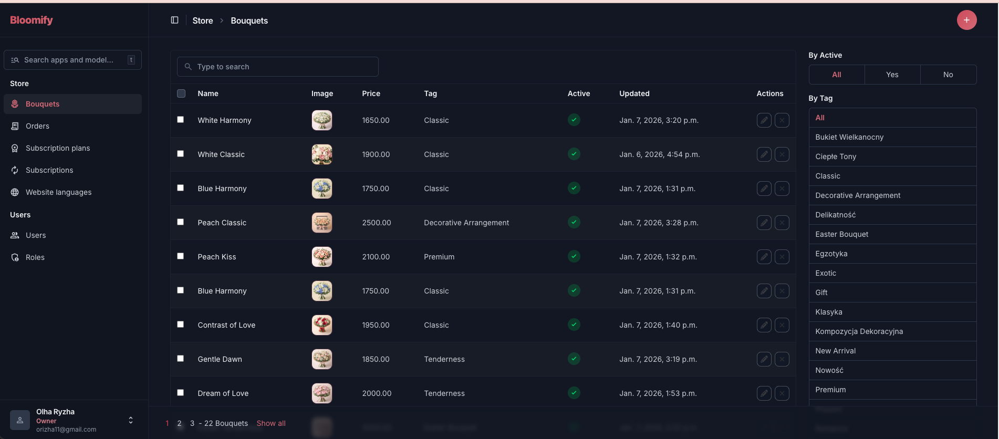

### 2. Orders list

The orders list is the main operational view for checkout records. It displays order ID, customer name, payment method, payment status, total price, current order status, and creation date.

This screen is connected to the checkout flow in the storefront. It helps the admin review orders created through payment-on-delivery scenarios and LiqPay sandbox payment scenarios. For each order, the admin can see whether payment was completed, whether payment was not required, and what fulfillment state the order is currently in.

The right sidebar includes filters for **Status** and **Payment status**. These filters make it easier to separate operational queues: pending payment, paid, processing, ready for delivery, courier delivery, delivered, failed, fulfilled, and canceled. The table also includes search and pagination, so the admin can work with a larger number of orders without losing context.

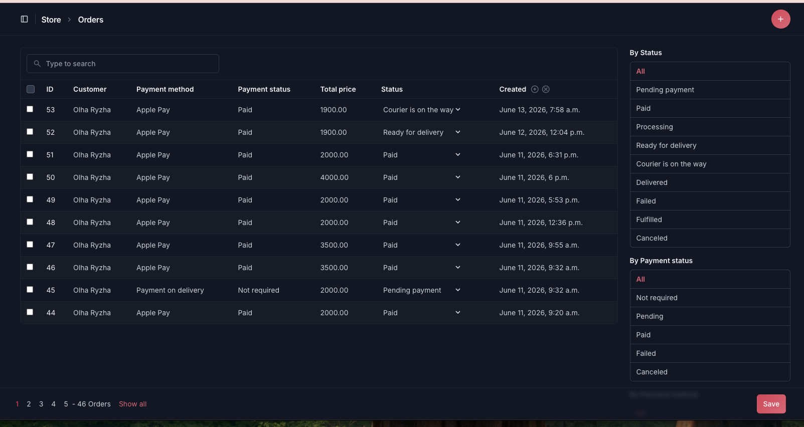

### 3. Inline order status update

The order status can be changed directly inside the orders table. The dropdown includes statuses such as pending payment, paid, processing, ready for delivery, courier is on the way, delivered, failed, fulfilled, and canceled.

This is useful for a real store workflow because an operator does not need to open a separate detail page for every small fulfillment update. For example, after payment confirmation, the order can be moved to processing, then ready for delivery, then courier delivery, and finally delivered or fulfilled.

The screenshot demonstrates an admin-friendly workflow for order lifecycle management. It turns the list table into a lightweight dispatch dashboard where order state can be adjusted quickly.

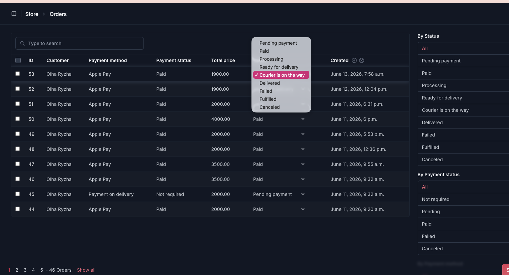

### 4. Users list

The users list shows admin accounts and their access flags. It includes username, email address, first name, last name, and staff status.

This screen belongs to the access-control part of the admin panel. Since the admin contains order, payment, catalog, and permission data, user management is separated from the Store section and placed under the Users area.

The right sidebar provides filters by staff status, superuser status, active status, and group. This makes it easier to audit who can enter the admin panel and which role group is assigned to each account. In the screenshot, one user has staff access and another does not, which demonstrates how different access levels can be reviewed from the list page.

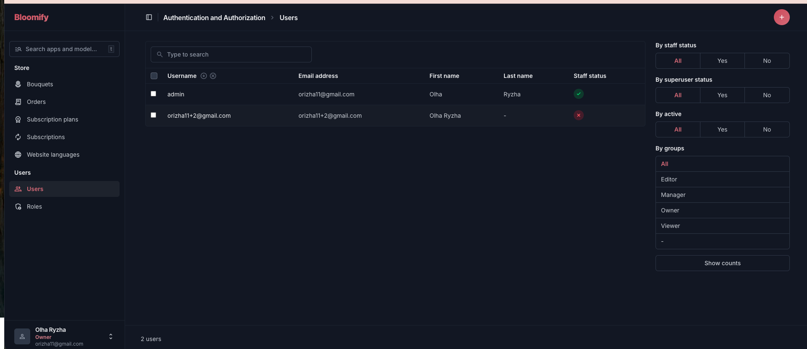

### 5. User creation form

The user creation form is used to create a new admin account. It includes username, password-based authentication settings, password, and password confirmation.

The form keeps Django's standard password validation guidance visible: the password should not be too similar to personal information, should contain at least eight characters, should not be a commonly used password, and should not be entirely numeric.

This screen is important because Bloomify does not expose public admin credentials. Admin users should be created intentionally, with controlled authentication and permissions. After a user is created, additional options such as permissions, role groups, staff status, and superuser status can be configured.

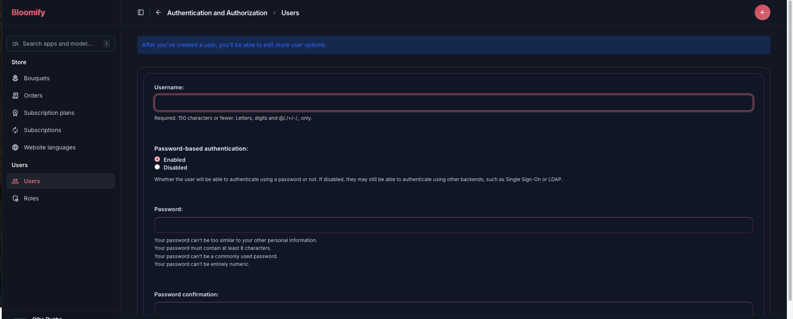

### 6. Bulk order actions

The orders table supports checkbox selection and bulk actions. In this screenshot, all visible order rows are selected and the actions dropdown is open.

The selected action is **Delete selected Orders**, which is a standard administrative operation for selected records. In a production environment, this type of action should be used carefully, but the screenshot demonstrates that the admin supports multi-record workflows instead of only single-row edits.

This is especially helpful for back-office maintenance tasks where many test orders, failed orders, or obsolete records may need to be managed together. The visual selection state also makes it clear which records will be affected before the action is applied.

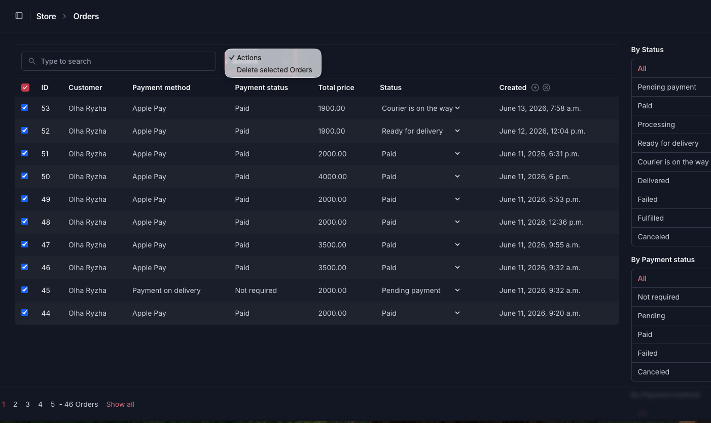

### 7. User role assignment

The user edit screen includes access flags and group assignment. The visible flags are **Active**, **Staff status**, and **Superuser status**.

The **Groups** section allows the admin to assign predefined roles such as Editor, Manager, Owner, and Viewer. This keeps access management role-based and more maintainable than assigning many direct permissions to each individual user.

The screenshot shows the **Owner** role selected. This means the user receives permissions through the saved Owner group configuration. It also demonstrates the intended access-control model: common access should be handled through roles, while direct permissions should be used only for narrow exceptions.

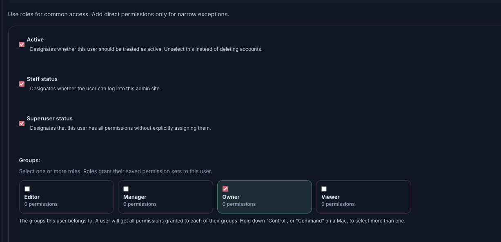

### 8. Bouquet edit form with translations

The bouquet edit form supports multilingual product content through language tabs: Ukrainian, English, and Polish. Each language tab can contain localized fields such as name and description.

The screenshot shows the Ukrainian version of a bouquet. Admins can edit the translated name, description, price, image, tag, and active status from the same product editing workflow.

This connects directly to the storefront's localized catalog feature. The frontend can show bouquet content in the currently selected language while the admin provides a structured place to maintain those translations. For a multilingual ecommerce project, this is more scalable than hardcoding text in the frontend.

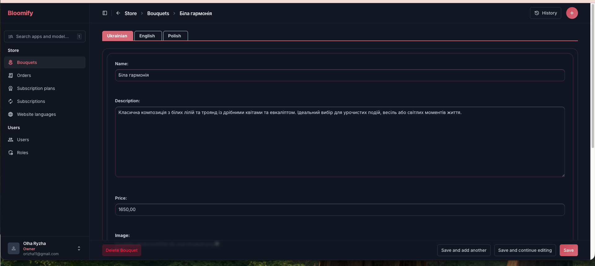

### 9. Bouquet image preview

The bouquet edit form includes image management controls. The admin can see the current image path, clear the current image, choose a replacement file, and review the rendered preview.

The preview is useful because catalog images are a key part of the storefront experience. It helps verify that the uploaded bouquet photo matches the product before saving changes.

The same form also includes tag and active status fields, so the admin can control both the visual product representation and whether the bouquet is available in the catalog. This screenshot shows the lower part of the bouquet editing page where media and publishing-related fields are managed.

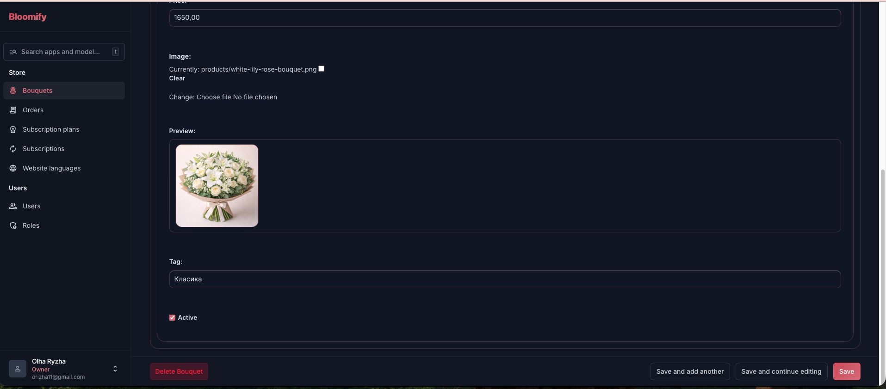

### 10. Subscription plans empty state

The subscription plans section is present in the Store admin area and includes filters by interval and active status. The current screenshot shows an empty state because there are no subscription-plan records yet.

The empty state gives the admin two clear options: add a new subscription plan or reset filters. This keeps the page usable even before data is created.

This section prepares the admin for subscription-related functionality, where plans can be organized by billing interval such as weekly, monthly, or quarterly. It also demonstrates that the admin navigation already has a dedicated place for subscription management even when the database is still empty.

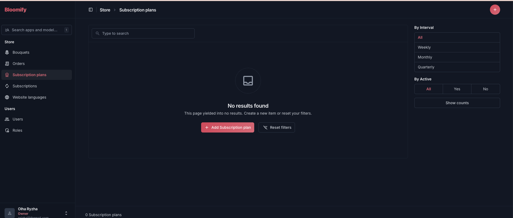

### 11. Roles list before permissions are assigned

The roles screen lists available groups and shows how many permissions are assigned to each group. In this state, Editor, Manager, Owner, and Viewer all have zero permissions.

This is a useful setup state because it shows the role model before permissions are configured. The admin can create the role names first and then gradually assign access according to the intended responsibility of each role.

The permissions count column makes the role setup auditable from the list page. If a role unexpectedly has too many or too few permissions, this page can quickly reveal the issue before a user is assigned to that role.

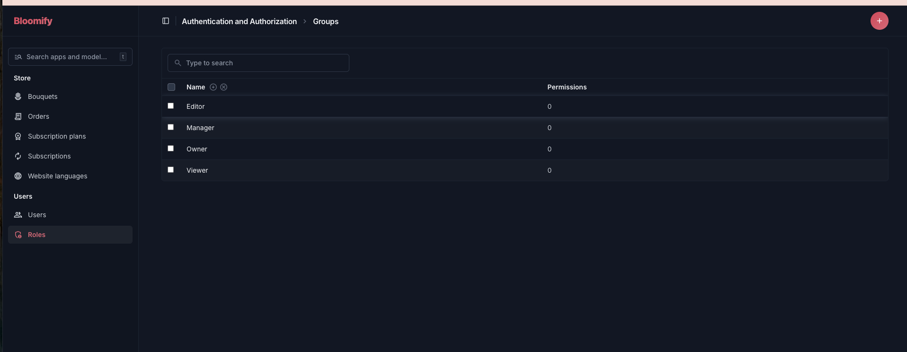

### 12. Site language settings

The site language settings page controls which storefront languages are enabled. Bloomify supports Ukrainian, English, and Polish, and the screenshot shows all three languages enabled.

This admin page is small but important because it controls the language availability used by the localized storefront and catalog. If a language is disabled here, it can be hidden from the public site even if translations exist in the database.

The page is connected to the multilingual architecture of the project: bouquet translations can exist in multiple languages, and the admin can decide which languages should currently be available to users on the site.

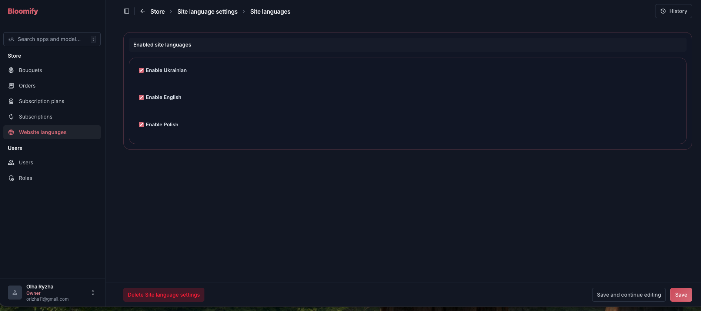

### 13. Roles list after Owner permissions are assigned

After permissions are assigned, the roles list shows the permission count for each group. In this screenshot, the **Owner** role has 52 permissions while the other roles still have zero.

This makes permission state easy to audit from the list page. Admins can immediately see which role has broad access and which roles still need configuration.

The success message at the top confirms that the Owner group was changed successfully. This screen demonstrates the result of editing role permissions and returning to the role overview.

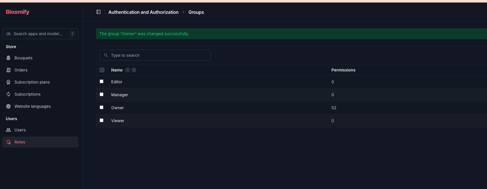

### 14. Admin preferences menu

The account menu provides quick access to interface and account preferences. It includes light, dark, and system theme options; Ukrainian, English, and Polish interface language options; a link to view the site; password change; and logout.

This matches the admin's multilingual and dark-theme setup. It also makes the admin more comfortable to use during content management, testing, and operational review.

The menu is useful in a demo project because it shows that the admin experience is not only functional, but also customized for localization and user preferences.

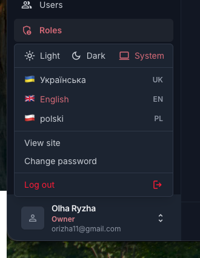

### 15. Role permission editor

The role permission editor groups permissions by business domain. Instead of showing one long flat list, it organizes access into readable categories such as Bouquets, Order items, Orders, and Site language settings.

Each category shows a permission counter, for example `0/4`, so the admin can see how many actions are selected inside that group. This supports a safer permission workflow: read access can be granted separately from create, edit, and delete access.

The page also includes guidance to use roles for common access and direct permissions only for narrow exceptions. This helps avoid accidental over-permissioning and makes the access model easier to explain during project review.

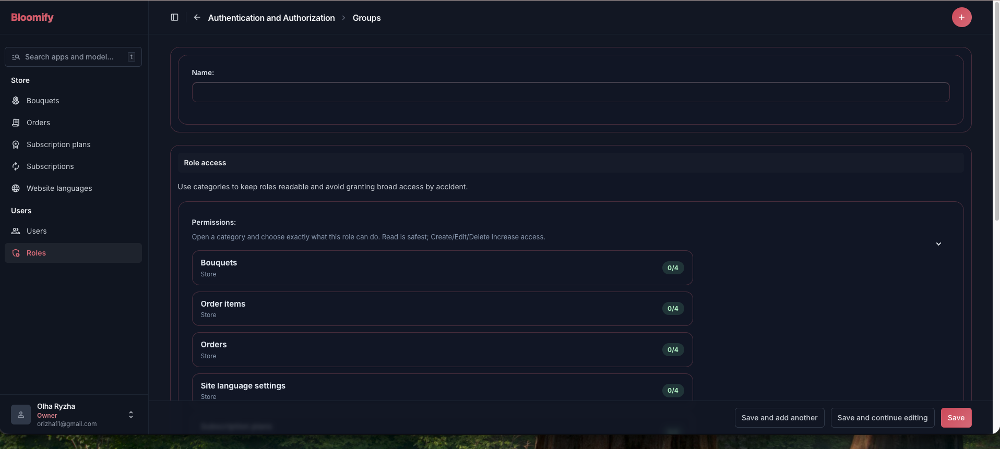

## Why the admin is presented with screenshots

The admin area is intentionally not shared with public demo credentials because it contains sensitive operational controls: users, permissions, orders, payments, catalog records, and language settings. Screenshots make it possible to review the implemented admin functionality without exposing privileged access.

## Admin scope summary

| Module | Implemented functionality |
| --- | --- |
| **Bouquets** | Search, tag filters, active filters, image thumbnails, image preview, localized fields, active status, edit/delete actions. |
| **Orders** | Search, pagination, status filters, payment-status filters, inline status update, bulk selection, bulk actions. |
| **Website languages** | Enable/disable Ukrainian, English, and Polish storefront languages. |
| **Subscription plans** | Admin section with interval filters, active filters, reset filters action, and empty state for first record creation. |
| **Users** | User list, user creation, password authentication, active/staff/superuser flags, group assignment. |
| **Roles** | Role list, permission counters, Owner role permission setup, categorized permission editor. |
| **Admin UI** | Dark theme, sidebar navigation, breadcrumbs, sticky action bar, language preferences, theme preferences, account menu. |

## Related project areas

- **Backend**: Python 3.12, Django, Django REST Framework, PostgreSQL, django-parler, django-unfold.
- **Frontend storefront**: Next.js App Router, React, TypeScript, Tailwind CSS, TanStack Query, Zustand, Formik, Zod, Axios.
- **Payments**: LiqPay sandbox integration for card, Apple Pay, and Google Pay checkout scenarios.
- **Quality**: Vitest, Testing Library, MSW, Playwright, ESLint, Ruff, Black, mypy, pre-commit, and GitHub Actions.
